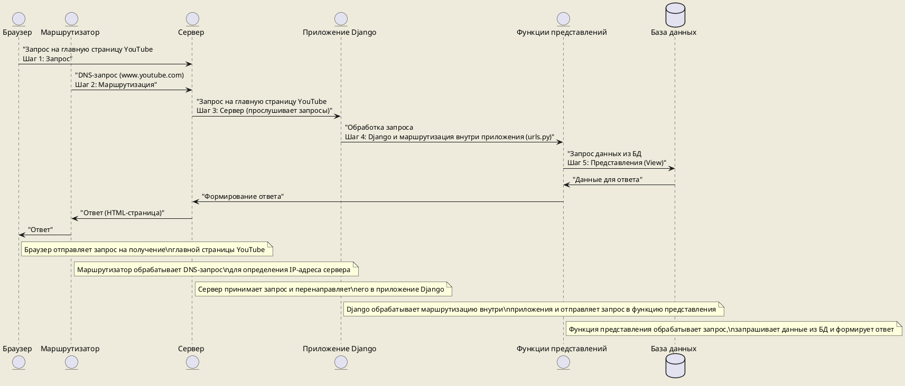

## Что такое Django?

Джанго (Django) — это высокоуровневый фреймворк для веб-разработки на языке Python, который позволяет быстро создавать безопасные и поддерживаемые веб-сайты. Фреймворк предоставляет множество готовых компонентов для веб-разработки, так что разработчикам не приходится писать многочисленный стандартный код с нуля.

**Что такое фреймворк и как это отличается от библиотеки?**

- **Фреймворк** — это набор компонентов и инструментов, который задаёт структуру приложения и его архитектурные основы. Разработчик помещает свой код в уже определённую структуру фреймворка, следуя его правилам и используя предоставленные возможности. Фреймворк "владеет" основным потоком управления приложением.
- **Библиотека** — это сборник функций и инструментов, которые разработчик может вызвать и использовать в своём коде по своему усмотрению, без строгого следования какой-либо предопределённой структуре.

**Отличия Джанго от Фласка:**

- **Джанго** представляет собой "батарейки включены" фреймворк, что означает наличие большого количества встроенных функций для немедленного использования (например, аутентификация, карты сайта, административный интерфейс).
- **Фласк** — это микрофреймворк, предлагающий больше гибкости и простоту за счёт минималистичного подхода. Фласк предоставляет базовые инструменты для веб-разработки, позволяя разработчикам самостоятельно выбирать дополнительные компоненты, такие как системы форм, баз данных и т. д.
- **Джанго** имеет встроенную ORM (Object-Relational Mapping), что упрощает работу с базой данных и обеспечивает структурированный подход к моделированию данных. В то время как **Фласк** не имеет встроенной ORM, что оставляет разработчику больше свободы в выборе инструментов для работы с базой данных.
- **Джанго** предоставляет механизмы аутентификации и авторизации пользователей из коробки, что делает процесс создания защищенного приложения более простым. В то время как **Фласк** не имеет встроенных механизмов аутентификации и авторизации, но существуют сторонние расширения для добавления такой функциональности.
- **Джанго** обладает мощными инструментами для работы с административным интерфейсом, который автоматически генерируется на основе моделей данных. В то время как в **Фласке** разработчику нужно создавать административный интерфейс самостоятельно или использовать сторонние библиотеки для этого.
- В целом, **Джанго** подходит для быстрой разработки приложений с большим количеством функциональности и сложной структурой данных, в то время как **Фласк** предпочтителен для небольших проектов или тех, где требуется большая гибкость и контроль над каждым аспектом приложения.

**Крупные проекты, использующие Джанго:**

1. **Instagram** — одно из самых известных приложений для обмена фотографиями и видео.
2. **Disqus** — платформа для комментариев, широко используемая на множестве сайтов.
3. **Mozilla** — разработчики популярного веб-браузера Firefox также используют Джанго для некоторых своих веб-проектов.
4. **Spotify** — сервис для потокового воспроизведения музыки также использует элементы Джанго для некоторых своих бэкенд-сервисов.

**Терминальные команды для начала работы с Джанго:**

1. Установка Django:
   ```
   pip install django
   ```
2. Создание нового проекта в Django:
   ```
   django-admin startproject имя_проекта

	django-admin startproject имя_проекта .
   ```
Вариант с точкой создаст новый проект в текущей директории, а вариант без точки создаст новую директорию с именем проекта.

1. Запуск сервера разработки:
   ```
   python manage.py runserver
   ```
4. Создание нового приложения в проекте:
   ```
   python manage.py startapp имя_приложения
   ```

Эти команды — лишь начальный этап работы с Джанго. Дальнейшая разработка включает в себя создание моделей для базы данных, представлений для обработки запросов, шаблонов для отображения контента, настройку URL-адресов и многое другое. Важно помнить, что успешная работа с фреймворком требует понимания его архитектуры и следования лучшим практикам разработки.

# Маршрутизация в Django

Когда вы открываете YouTube или любой другой веб-сайт, происходит ряд действий, которые включают в себя маршрутизацию, серверы, обработку запросов и многое другое. Давайте разберёмся, что происходит шаг за шагом.

### Шаг 1: Запрос

Когда вы вводите адрес (например, `www.youtube.com`) в адресную строку браузера и нажимаете Enter, ваш браузер отправляет запрос на сервер. Этот запрос говорит серверу, что вы хотите получить доступ к главной странице YouTube.

### Шаг 2: Маршрутизация

- **Маршрутизация** – это процесс определения того, какой сервер (или какое приложение на сервере) должен обработать запрос. В интернете это обычно начинается с DNS-запроса (Domain Name System), который преобразует удобный для человека доменный адрес (`www.youtube.com`) в IP-адрес сервера, где хранится сайт. После определения IP-адреса ваш запрос перенаправляется через интернет к соответствующему серверу.

### Шаг 3: Сервер

- **Сервер** – это компьютер или программное обеспечение, который слушает запросы из сети и отвечает на них. Когда сервер получает ваш запрос, он должен определить, как его обработать. В контексте веб-разработки на Django, сервер обычно настроен на прослушивание входящих HTTP-запросов на определённом порту (стандартно это порт 80 для HTTP или порт 443 для HTTPS).

### Шаг 4: Django и маршрутизация внутри приложения

Когда запрос достигает сервера, на котором развернуто приложение Django, Django использует свою систему маршрутизации для определения, какой код должен обработать этот запрос. В Django есть файл `urls.py`, который содержит сопоставления URL-адресов с функциями представлений. Этот процесс похож на почтовую систему, где письмо направляется по адресу, а затем по специфическим указаниям внутри здания к конкретному получателю.

### Шаг 5: Представления

- **Представление (View)** в Django – это функция Python, которая принимает веб-запрос и возвращает веб-ответ. Представления "слушают" определённые URL-адреса и обрабатывают запросы, соответствующие этим адресам. Каждое представление выполняет определённую логику: это может быть запрос к базе данных для получения данных, обработка данных, отправленных пользователем через форму, или просто формирование и отправка HTML-страницы в ответ.

### Шаг 6: Ответ

После обработки запроса представлением Django генерирует ответ и отправляет его обратно в браузер. Этот ответ может быть в форме HTML-страницы, JSON-объекта (например, для API) или любого другого формата данных. Браузер получает ответ и отображает его пользователю, завершая тем самым цикл запроса-ответа.


### В заключение

Этот процесс демонстрирует, как работают веб-запросы и ответы, роль маршрутизации, серверов, и как веб-фреймворки, такие как Django, упрощают разработку современных веб-приложений, предоставляя структурированный подход к обработке запросов и генерации ответов.

## Запуск приложение Django

Чтобы запустить Django в домашних условиях и в учебных целях, следуйте этой пошаговой инструкции. Этот процесс включает установку фреймворка на ваш компьютер, создание и активацию виртуального окружения, а также запуск отладочного сервера. Мы будем работать в терминале Windows.

### Шаг 1: Установка Python

Убедитесь, что у вас установлен Python. Django требует Python. Если он не установлен, скачайте и установите его с официального сайта python.org. В процессе установки не забудьте отметить опцию добавления Python в переменную среды PATH.

### Шаг 2: Создание папки проекта

1. Откройте терминал Windows (например, Command Prompt или PowerShell).
2. Создайте директорию для вашего проекта и перейдите в неё:
   ```
   mkdir мой_проект
   cd мой_проект
   ```

### Шаг 3: Создание виртуального окружения

1. Создайте виртуальное окружение внутри папки проекта:
   ```
   python -m venv venv
   ```
2. Активируйте виртуальное окружение:
   - Для Windows в Command Prompt:
     ```
     venv\Scripts\activate
     ```
   - Для Windows в PowerShell:
     ```
     .\venv\Scripts\Activate.ps1
     ```
   После активации виртуального окружения вы увидите его название перед приглашением командной строки.

### Шаг 4: Установка Django

Установите Django версии 4.2 в ваше виртуальное окружение:
```
pip install django==4.2
```

### Шаг 5: Проверка установки Django

Проверьте, что Django установлен корректно:
```
pip freeze
```
В выводе команды должна появиться строка, подтверждающая установку Django и его версии.

### Шаг 6: Открытие проекта в PyCharm

1. Откройте PyCharm и используйте опцию "Open" для открытия папки вашего проекта.
2. Если PyCharm не распознал виртуальное окружение автоматически, настройте его вручную:
   - Перейдите в "File" > "Settings" > "Project: мой_проект" > "Python Interpreter".
   - Нажмите на шестерёнку справа и выберите "Add".
   - В открывшемся окне выберите "Existing environment" и укажите путь к интерпретатору в вашем виртуальном окружении (`мой_проект\venv\Scripts\python.exe`).
3. Закройте и снова откройте терминал в PyCharm, чтобы убедиться, что виртуальное окружение активировано.

### Шаг 7: Запуск отладочного сервера

Чтобы запустить проект на Django и поднять локальный сервер (localhost), выполните следующие действия в терминале PyCharm или в командной строке:

1. Создайте новый проект Django (если это не было сделано ранее):
   ```
   django-admin startproject мой_джанго_проект
   ```
2. Перейдите в папку проекта:
   ```
   cd мой_джанго_проект
   ```
3. Запустите отладочный сервер:
   ```
   python manage.py runserver
   ```

После этого сервер запустится, и вы сможете открыть ваш Django проект в браузере, перейдя по адресу `http://127.0.0.1:8000/`.

Следуя этим шагам, вы сможете настроить и запустить локальный сервер для разработки на Django в домашних условиях.


## Django admin, manage и создание проекта

Давайте разберёмся, как работать с Django, начиная с команды `django-admin startproject` и вплоть до запуска отладочного сервера, а также обсудим другие аспекты, упомянутые в вашем запросе.

### Шаг 1: Список команд `django-admin`

`django-admin` — это командный интерфейс Django, который предоставляет различные утилиты для управления проектами на Django. Чтобы просмотреть список всех доступных команд, вы можете использовать следующую команду в терминале:

```
django-admin help
```

Эта команда покажет вам список всех доступных команд `django-admin`, включая `startproject`, `startapp`, `migrate` и другие.

### Шаг 2: Создание нового проекта

Команда `startproject` используется для создания нового проекта Django. Если вы хотите создать проект с именем, аналогичным доменному имени (например, `dodo.ru`), имя вашего проекта может быть просто `dodo`. Выполните следующую команду:

```
django-admin startproject dodo

```

После выполнения этой команды в вашей рабочей директории появится новый каталог `dodo`, содержащий начальный набор файлов для проекта, включая `manage.py`.

```
django-admin startproject dodo .

```

### Пакет конфигурации

Каталог, созданный командой `startproject`, содержит пакет конфигурации — это директория с тем же именем, что и ваш проект (`dodo` в нашем случае), внутри которой находятся файлы настроек проекта (`settings.py`), файла маршрутизации URL (`urls.py`), и другие. Эти файлы определяют конфигурацию вашего проекта Django.

### Файл `manage.py`

`manage.py` — это автоматически сгенерированный скрипт, который предоставляет командный интерфейс для взаимодействия с вашим проектом Django. С его помощью вы можете выполнять различные команды, такие как запуск сервера, создание миграций и многое другое.

### Запуск отладочного сервера

Для запуска встроенного отладочного сервера Django из директории проекта (где находится `manage.py`) используйте следующую команду:

```
python manage.py runserver
```

После запуска сервера вы можете перейти по ссылке, указанной в терминале (обычно `http://127.0.0.1:8000/`), чтобы увидеть стартовую страницу Django, на которой изображена ракета.

### Отладочный сервер

Отладочный сервер — это лёгкий веб-сервер, предоставляемый Django для разработки и тестирования. Он автоматически перезапускается при изменении кода в проекте, что упрощает разработку. Однако в некоторых случаях (например, при изменении файлов конфигурации) может потребоваться его перезапуск вручную, используя сочетание клавиш `Ctrl+C` в терминале и повторный запуск команды `runserver`.

### Запуск сервера на другом порту

Если вы хотите запустить сервер на порту, отличном от стандартного (8000), просто укажите номер порта в команде:

```
python manage.py runserver 8080
```

Теперь сервер будет доступен по адресу `http://127.0.0.1:8080/`.

### SQLite и переход на другие СУБД

По умолчанию Django использует SQLite в качестве базы данных. SQLite — это лёгкая встраиваемая СУБД, идеально подходящая для разработки и тестирования. Позднее, когда вы будете готовы к развертыванию или если вам нужны более продвинутые функции базы данных, вы можете переключиться на другую СУБД, такую как PostgreSQL или MySQL, изменив настройки `DATABASES` в файле `settings.py` вашего проекта.

## Обработка запросов. Django MTV и маршруты

Django обрабатывает запросы пользователя, следуя архитектурному паттерну МТВ (Модель-Шаблон-Вид), который является вариацией популярного паттерна MVC (Model-View-Controller). В контексте Django:

- **Модель (Model)** определяет структуру данных. Это классы Python, которые определяют поля и поведение данных, которые вы хотите хранить. Модели Django используются для создания таблиц в базе данных.
- **Шаблон (Template)** отвечает за представление данных. Это файлы, которые описывают структуру или макет страницы (или части страницы) с помощью специального синтаксиса Django для вставки данных из Видов.
- **Вид (View)** содержит логику приложения, которая определяет, какие данные должны быть отображены в Шаблоне. Виды могут быть как функциями, так и классами. Они принимают веб-запрос и возвращают веб-ответ, часто используя данные, полученные из Моделей, и Шаблоны для генерации этого ответа.
![[Pasted image 20240206102141.png]]

![[Pasted image 20240206102202.png]]

### Как Django обрабатывает запросы:

1. **Запрос от пользователя:** Когда пользователь запрашивает страницу (например, главную страницу сайта или страницу категории), запрос сначала проходит через систему URL-маршрутизации Django.

2. **Маршрутизация по URL:** URL-конфигурации (`urls.py`) определяют соответствие между URL-адресами и Видами. Django проверяет URL-адреса в порядке их определения, чтобы найти соответствующий Вид для обработки запроса. Например, запрос к `/categories/1` будет направлен к Виду, который обрабатывает запросы категорий.

3. **Представления (Виды):** Вид принимает запрос, выполняет необходимую логику (например, извлекает данные из Модели) и готовит данные для отображения. Затем он может рендерить Шаблон с этими данными, возвращая сгенерированный HTML в качестве ответа.

4. **Модель базы данных:** Если Виду для формирования ответа требуются данные, он обращается к соответствующим Моделям, которые представляют структуры данных в базе данных. Модели помогают извлекать, обновлять, создавать или удалять данные.

5. **Шаблоны:** Вид использует Шаблон, передавая в него необходимые данные. Шаблон генерирует HTML-ответ, в котором данные из Вида вставлены в соответствующие места.

6. **Ответ пользователю:** Сгенерированный HTML возвращается браузеру пользователя в качестве ответа.

### Что происходит, если URL не совпадает?

Если для запрошенного URL не находится соответствующего Вида (то есть нет совпадения в URL-конфигурациях), Django возвращает стандартную страницу ошибки 404, указывая на то, что запрашиваемый ресурс не найден.

### Вывод

Таким образом, каждому URL в приложении Django соответствует определённый Вид, который может использовать один или несколько Шаблонов для генерации HTML-ответа. Модели используются для взаимодействия с базой данных и предоставления данных Видам. Эта модульность и разделение ответственности между компонентами делают разработку в Django гибкой и мощной, позволяя разработчикам легко создавать сложные веб-приложения.

## Django App


В Django приложение является самостоятельным компонентом, который предназначен для выполнения определённой функции в рамках проекта. Приложение может быть чем угодно: блогом, форумом, системой комментариев, опросами и т.д. Создание отдельных приложений для каждой функциональной части сайта помогает организовать код более структурированно и упрощает повторное использование кода в других проектах.

### Как создать приложение в Django

Для создания приложения необходимо выполнить следующие шаги:

1. Убедитесь, что вы находитесь в директории проекта, где присутствует файл `manage.py`.
2. Используйте следующую команду для создания нового приложения. Например, если вы хотите создать приложение для форума, вы можете назвать его `forum`:

```bash
python manage.py startapp forum
```

Эта команда создаст новую директорию с именем `forum` внутри вашего проекта Django, содержащую начальный набор файлов для приложения.

### Что находится внутри приложения

В созданном приложении вы найдёте следующие файлы:

- **admin.py** - файл для настройки административной панели Django для вашего приложения. Здесь вы можете зарегистрировать модели, чтобы они были доступны в админ-панели.
- **apps.py** - содержит конфигурацию приложения, включая его имя и другие опции.
- **models.py** - файл для определения моделей данных вашего приложения. Модели представляют структуру вашей базы данных.
- **tests.py** - для написания тестов для вашего приложения.
- **views.py** - содержит представления вашего приложения. Представления отвечают за обработку запросов и формирование ответов для пользователя.

### Регистрация приложения в проекте

После создания приложения его необходимо зарегистрировать в проекте, чтобы Django "узнал" о его существовании. Для этого:

1. Откройте файл `settings.py` в папке вашего проекта.
2. Найдите список `INSTALLED_APPS` и добавьте название вашего приложения в виде строки. Например, для приложения `forum` это будет выглядеть так:

```python
INSTALLED_APPS = [
    # Другие установленные приложения
    'forum',
]
```

Также, вы можете указать путь к классу конфигурации приложения, используя точечный синтаксис:

```python
INSTALLED_APPS = [
    # Другие установленные приложения
    'forum.apps.ForumConfig',
]
```

Это особенно полезно, когда для приложения требуется выполнить дополнительную конфигурацию через класс `AppConfig`.

### Вывод

Создание приложений в Django позволяет структурировать ваш проект, разделяя его на логические части. Каждое приложение выполняет свою функцию и может быть легко перенесено в другой проект Django. Важно помнить о регистрации каждого нового приложения в `INSTALLED_APPS` в файле `settings.py`, чтобы Django мог корректно с ним работать.

## Первое представление

Давайте шаг за шагом создадим обработчик для главной страницы сайта на Django, используя функцию в качестве представления. Этот процесс включает в себя создание функции представления, настройку URL-адреса для этого представления, и запуск отладочного сервера для тестирования.

### Шаг 1: Создание представления

Представление в Django — это Python-функция, которая принимает веб-запрос и возвращает веб-ответ. Эту функцию нужно разместить в файле `views.py` внутри вашего приложения.

```python
# В файле views.py вашего приложения
from django.http import HttpResponse

def index(request):
    return HttpResponse("Привет, мир!") # вернет страничку с надписью "Привет, мир!" на русском языке.
```

Здесь `index` — это функция представления, которая принимает объект `request` (запрос) и возвращает объект `HttpResponse`, содержащий строку приветствия. Объект `request` является экземпляром `HttpRequest` и содержит всю информацию о запросе пользователя.

В контексте веб-разработки на Django, понятия `request` и `HttpResponse` являются ключевыми элементами в обработке веб-запросов и формировании ответов.

### Что такое `request`?

Когда вы заходите на веб-сайт, ваш браузер отправляет запрос на сервер. В контексте Django `request` — это объект Python, который содержит информацию о запросе. Эта информация включает в себя URL, метод запроса (например, GET или POST), заголовки, данные, отправленные пользователем, и многое другое. `request` не является просто текстом; это сложный объект, предоставляющий структурированный доступ к этим данным.

#### Заголовок и тело

- **Заголовок** запроса содержит мета-информацию: тип запроса, тип содержимого (например, HTML, JSON), куки и дополнительные параметры, такие как токены аутентификации.
- **Тело** запроса содержит данные, отправленные пользователем, например, форму с логином и паролем или данные для нового поста в блоге.

### Что такое `HttpResponse`?

`HttpResponse` — это ответ сервера на запрос. В Django это объект, который вы создаете в своих представлениях (views) для отправки данных обратно в браузер пользователя. `HttpResponse` может содержать HTML-код страницы, JSON, изображение или любой другой тип контента, а также статус код ответа.

### Почему `HttpResponse` иногда называют контроллером?

В некоторых фреймворках и архитектурных подходах, например MVC (Model-View-Controller), компонент, отвечающий за обработку входящих запросов и возвращение ответов, называется контроллером. В Django представления (views) выполняют эту роль, а `HttpResponse` является частью механизма, через который представления отправляют данные обратно пользователю. Поэтому иногда `HttpResponse` условно называют "контроллером", хотя более точно это название относится к самим представлениям.

### Статус коды

Статус коды HTTP — это стандартизированные числовые значения, которые сервер использует, чтобы сообщить клиенту (например, браузеру) о результате запроса.

- **По умолчанию** `HttpResponse` отдает статус код `200`, который означает "ОК" — запрос успешно обработан.
- **Изменение статус кода** может потребоваться для указания на конкретный результат обработки запроса. Например, если страница не найдена, вы можете использовать код `404`, если доступ запрещен — код `403`, для перенаправления — `302` и так далее.

### Какие статус коды бывают?

Статус коды делятся на несколько категорий:

- `1xx` — Информационные.
- `2xx` — Успех: например, `200 OK` или `201 Created`.
- `3xx` — Перенаправления: например, `301 Moved Permanently` для постоянных перенаправлений.
- `4xx` — Ошибки клиента: `404 Not Found`, `403 Forbidden`.
- `5xx` — Ошибки сервера: `500 Internal Server Error`, `503 Service Unavailable`.

### Состав `HttpResponse`

1. **Статус код** — это числовой код, который сообщает браузеру, как был обработан запрос. Например, статус код `200` говорит, что все хорошо и страница загрузилась успешно. Код `404` сообщает, что запрашиваемая страница не найдена.
    
2. **Заголовки** — это дополнительная информация в ответе, которая может сообщать браузеру, как обрабатывать ответ (например, какой тип содержимого он содержит, нужно ли кешировать страницу).
    
3. **Тело ответа** — это собственно содержимое ответа. Это может быть HTML-страница, изображение, JSON-объект и так далее.

### Использование в Django

В Django вы можете легко изменить статус код ответа, просто указав его при создании объекта `HttpResponse`, например:

```python
from django.http import HttpResponse

def my_view(request):
    # Логика вашего представления
    return HttpResponse("Содержимое ответа", status=404)  # Страница не найдена
```

Понимание `request` и `HttpResponse`, а также умение работать со статус кодами, является ключевым для создания веб-приложений с Django, которые корректно взаимодействуют с пользователем и другими сервисами.

#### Вывод

`request` и `HttpResponse` в Django являются фундаментальными концепциями для обработки входящих запросов и формирования ответов в веб-приложениях. Понимание этих элементов критически важно для разработки эффективных и динамических веб-сайтов на Django.

### Шаг 2: Настройка URL-адреса

Чтобы связать созданное представление с URL-адресом, вам необходимо настроить маршрутизацию в файле `urls.py`. Если вы хотите, чтобы ваше представление отвечало на главную страницу сайта, вам нужно добавить новый URL-паттерн в `urls.py` проекта или приложения.

```python
# В файле urls.py вашего проекта или приложения
from django.urls import path
from .views import index  # Импортируем представление

urlpatterns = [
    path('', index, name='home'),
]
# path это - функция, которая определяет URL-шаблон и связывает его с представлением
# index это - представление, которое будет вызвано при обращении к указанному URL
# name это - имя данного URL-шаблона, которое позволяет обращаться к нему по имени в шаблонах и в Python-коде
```

В этом примере мы использовали функцию `path` для создания маршрута. Первый аргумент — это паттерн URL-адреса. Поскольку мы хотим, чтобы это была главная страница, мы оставляем строку пустой. Второй аргумент — это представление, которое должно быть вызвано при совпадении URL-адреса, в нашем случае — функция `index`.

### Слеши в URL

В Django не требуется ставить слеш (`/`) в начале паттерна URL-адреса в `urls.py`. Однако важно стандартизировать использование слеша в конце URL-адресов в вашем проекте. Django по умолчанию предпочитает стиль, когда URL-адреса заканчиваются слешем.

### Шаг 3: Запуск сервера

Теперь, когда представление и URL-адрес настроены, можно запустить отладочный сервер Django и проверить результат.

```bash
python manage.py runserver
```

Откройте браузер и перейдите по адресу `http://127.0.0.1:8000/`. Вы должны увидеть сообщение "Привет, мир!", которое было возвращено вашим представлением.

### Шаг 4: Наблюдение за запросами и ответами

Когда вы обращаетесь к серверу, в терминале, где запущен сервер, вы увидите запись о вашем запросе и статусе ответа. Это помогает отслеживать активность на сервере и удобно для отладки.

### Вывод

Создание обработчика для главной страницы в Django требует создания функции представления, настройки URL-адреса для этого представления в `urls.py`, и запуска отладочного сервера для тестирования. Следуя этим шагам, вы можете начать разработку своего веб-приложения на Django, создавая разные представления для обработки различных маршрутов URL-адресов.

## Представления категорий

Добавление нового представления в ваше приложение Django позволит обрабатывать разные разделы сайта, например, страницу категорий. Давайте шаг за шагом создадим представление для отображения категорий и обсудим, как лучше настроить маршрут для главной страницы.

### Шаг 1: Создание представления для категорий

Для начала добавим новое представление в файл `views.py` вашего приложения. Это представление будет просто возвращать HTTP-ответ с заголовком категории.

```python
# файл `views.py` обычно лежит по адресу `<название_проекта>/<название_приложения>/views.

from django.http import HttpResponse

def index(request):
    return HttpResponse("Привет, мир на главной странице!")

def category(request):
    return HttpResponse("Это страница категории.")
```

Здесь мы добавили функцию `category`, которая, как и функция `index`, принимает объект `request` и возвращает объект `HttpResponse`.

### Шаг 2: Настройка URL-адресов

Чтобы Django знал, когда вызывать ваше новое представление, нужно добавить соответствующий маршрут в `urls.py`. Возможно, вам потребуется настроить маршрутизацию как в файле `urls.py` вашего приложения, так и в файле `urls.py` уровня проекта. Если вы добавляете маршрут в приложение, убедитесь, что в `urls.py` уровня проекта настроено включение URL-адресов вашего приложения.

```python
# главный файл `urls.py` обычно лежит по адресу project_name/project_name/urls.

from django.urls import path
from . import views

urlpatterns = [
    path('', views.index, name='home'),
    path('category/', views.category, name='category'),
]
```

Теперь у нас есть два маршрута: один для главной страницы (`''`) и один для страницы категорий (`'category/'`).

### Пустой путь или с одним слешем для главной страницы?

В Django рекомендуется использовать пустую строку (`''`) для обозначения главной страницы сайта в `urls.py`. Это обеспечивает консистентность с другими URL-путями, где слеш в начале не используется. Добавление слеша в начале пути не поддерживается и может вызвать ошибки в маршрутизации.

Стоит ли добавлять слеш в конце пути?

В Django необязательно добавлять слеш в конце пути. Django автоматически обрабатывает URL-пути с и без слеша в конце как один и тот же путь. Однако, если вы хотите быть последовательным в своем коде, вы можете выбрать один стиль и придерживаться его для всех URL-путей на вашем сайте.

### Шаг 3: Запуск сервера и тестирование

После добавления нового представления и настройки URL-адресов запустите отладочный сервер, если он еще не запущен:

```bash
python manage.py runserver
```

Теперь вы можете проверить работу представлений, перейдя по адресам `http://127.0.0.1:8000/` для главной страницы и `http://127.0.0.1:8000/category/` для страницы категорий.

### Вывод

Добавление новых представлений и настройка маршрутов URL в Django позволяют легко расширять функциональность вашего сайта. Для главной страницы используйте пустой путь (`''`) в `urls.py`, чтобы обеспечить правильную маршрутизацию и избежать проблем с доступом к страницам. Создание отдельных представлений для различных разделов сайта, таких как категории, делает ваше приложение гибким и удобным для масштабирования.


## Конфигурация urls и `include`

Конфигурация URL-адресов в Django позволяет управлять тем, как запросы к вашему веб-сайту обрабатываются и направляются к соответствующим представлениям (views). Это ключевая часть веб-разработки, позволяющая создавать читаемые и легко управляемые URL-схемы для вашего проекта. Использование функции `include` в системе маршрутизации URL Django упрощает организацию URL-адресов, делая приложения более независимыми и модульными.

### Импорт функций представлений

Вы можете импортировать функции представлений поштучно в файл `urls.py` вашего проекта, например:

```python
from myapp.views import my_view
```

И затем напрямую использовать `my_view` при определении URL-паттернов. Однако, при большом количестве представлений это может стать громоздким и ухудшить читаемость кода.

### Использование `include` для модульности

Чтобы сделать URL-конфигурацию более модульной и поддерживать принцип независимости приложений, Django предлагает использовать функцию `include`. Это позволяет включать конфигурации URL других приложений в основной файл `urls.py` проекта. Такой подход облегчает разделение и управление маршрутами URL для каждого приложения.

### Создание `urls.py` в приложении

Для использования `include`, сначала создайте файл `urls.py` внутри вашего приложения, если он еще не создан. В этом файле вы определите URL-паттерны специфичные для данного приложения.

```python
# myapp/urls.py
from django.urls import path
from . import views

urlpatterns = [
    path('example/', views.example_view, name='example'),
    # Другие URL-паттерны для приложения
]
```

### Использование `include` в основном `urls.py`

Затем, в основном файле `urls.py` проекта, вы можете использовать `include` для добавления URL-паттернов из вашего приложения:

```python
# project/urls.py
from django.urls import path, include

urlpatterns = [
    path('myapp/', include('myapp.urls')),
    # Другие включения или URL-паттерны
]
```

В этом примере, все URL-адреса, определенные в `myapp/urls.py`, будут доступны по пути, начинающемуся с `myapp/`. Это позволяет группировать URL-адреса по приложениям и делает структуру URL вашего проекта более понятной и легко расширяемой.

### Преимущества подхода

Использование `include` не только помогает поддерживать код чистым и организованным, но и способствует повторному использованию приложений. Вы можете легко перенести приложение в другой проект Django, включая его URL-конфигурацию одной строкой кода с помощью `include`. Это упрощает процесс масштабирования и обновления приложений, так как не нужно копировать и вставлять один и тот же код в разные проекты.

### Вывод

Организация URL-адресов с использованием функции `include` в Django обеспечивает модульность и независимость приложений в вашем проекте. Это упрощает управление маршрутами и способствует лучшей организации кода, делая разработку и поддержку веб-приложений более эффективными.


## Конфигурация запуска Django в Pycharm для запуска кнопкой

Отладка проекта Django в среде разработки, такой как PyCharm, помогает разработчикам находить и исправлять ошибки в коде, а также понимать, как работает их приложение. Вот как можно настроить конфигурацию для запуска и отладки проекта Django.

### Настройка конфигурации запуска в PyCharm

1. **Откройте "Edit Configurations"**: В PyCharm перейдите в меню "Run" -> "Edit Configurations" для настройки новой конфигурации запуска.
2. **Добавление новой конфигурации**: Нажмите на плюсик (+) и выберите тип конфигурации для Python.
3. **Заполнение полей конфигурации**:
   - **Название**: Дайте конфигурации понятное имя, чтобы вы могли легко идентифицировать её среди других конфигураций.
   - **Рабочая директория**: Укажите директорию вашего проекта Django. Это папка, где находится файл `manage.py`.
   - **Интерпретатор языка**: Выберите интерпретатор Python для вашего виртуального окружения, если вы его используете, или глобальный интерпретатор, если виртуальное окружение не настроено.
   - **Script path**: Укажите путь к файлу `manage.py` в вашем проекте Django.
   - **Параметры**: Введите `runserver`, чтобы запустить разработческий сервер Django.

Для конфигурации запуска на кастомном порте надо добавить дополнительный параметр в поле "Параметры". Например, если вы хотите запустить сервер на порту 8000, введите `runserver 8000`.

![[Pasted image 20240307212750.png|1200]]

### Запуск и отладка проекта

- **Запуск проекта**: Выберите созданную конфигурацию и нажмите на кнопку запуска (зелёный треугольник) или используйте сочетание клавиш для запуска, указанное в PyCharm.
- **Отладка проекта**: Для запуска отладки выберите созданную конфигурацию и нажмите на кнопку отладки (иконка с жуком) рядом с кнопкой запуска.

![[Pasted image 20240307213101.png]]
### Важные моменты

- **Один порт**: Убедитесь, что до запуска конфигурации сервер разработки не запущен через терминал или другую конфигурацию, так как два процесса не могут одновременно занять один и тот же порт.
- **Дебаггинг**: Во время отладки вы можете столкнуться с тем, что страница в браузере "зависает" или загружается бесконечно. Это происходит потому, что отладчик ожидает выполнения кода до тех пор, пока вы не продолжите выполнение в PyCharm.
- **Изучение переменных**: В режиме отладки вы можете остановить выполнение кода на определённой точке (breakpoint), чтобы изучить содержимое переменных, например, объекта `request`. Это делается через опцию "Evaluate Expression" (Евалуете) в PyCharm.

Использование отладчика позволяет глубже понять, как работает ваше приложение, и эффективно находить ошибки в коде, просматривая значения переменных и путь выполнения программы в реальном времени. Это незаменимый инструмент для разработки сложных проектов на Django.

## Конвертеры и маршруты

Для создания динамических URL-адресов в Django, которые позволяют обрабатывать различные категории по их идентификаторам или другим параметрам, используются пути с переменными частями. Эти переменные части обозначаются в URL-паттернах с помощью угловых скобок `< >`, в которых указывается тип переменной и её имя.

### Пример динамического URL

Допустим, у вас есть URL-адрес `/cats/`, который показывает список категорий. Чтобы создать URL-адреса для отдельных категорий вида `/cats/1/`, `/cats/2/` и так далее, вы можете использовать следующий паттерн в вашем `urls.py`:

```python
path('cats/<int:cat_id>/', views.cat_detail, name='cat_detail')
```

Здесь `<int:cat_id>` — это динамическая часть URL-паттерна. `int` указывает на то, что ожидаемое значение должно быть целым числом, а `cat_id` — это имя переменной, которая будет использоваться в вашей функции представления (view function) для идентификации категории.

### Изменение функции представления

Чтобы обработать динамический URL, ваша функция представления должна быть готова принимать дополнительные аргументы, соответствующие переменным в URL. Вот пример такой функции представления:

```python
from django.http import HttpResponse

def cat_detail(request, cat_id):
    return HttpResponse(f"<h1>Категория {cat_id}</h1><p>Описание категории {cat_id}</p>")
```

### Тестирование разных URL

Теперь, если вы перейдете по адресу `/cards/1/`, вы увидите страницу для категории 1. Аналогично, `/cards/2/` покажет страницу для категории 2. Если вы попытаетесь перейти по адресу, который не соответствует ожидаемому формату (например, `/cards/one/`), Django вернет ошибку 404 (страница не найдена), так как `one` не соответствует ожидаемому типу `int`.

### Пример конвертера int

```python
from django.urls import path

from . import views

app_name = 'cards'
urlpatterns = [
    path('cards/<int:category_id>/', views.category_detail, name='category_detail'),
]
```

В этом примере мы определяем конвертер `int` для переменной `category_id`. Это означает, что Django ожидает значение `category_id` в виде целого числа. Если значение не является целым числом, Django вернет ошибку 404.

### Пример конвертера slug

```python
from django.urls import path

from . import views

app_name = 'cards'
urlpatterns = [
    path('cards/<slug:slug>/', views.card_detail, name='card_detail'),
]
```

В этом примере мы определяем конвертер `slug` для переменной `slug`. Конвертер `slug` позволяет использовать только буквы, цифры, дефисы и подчеркивания в значении переменной. Если значение не соответствует этим требованиям, Django вернет ошибку 404.

### Пример конвертера uuid

```python
import uuid
from django.urls import path

from . import views

app_name = 'cards'
urlpatterns = [
    path('cards/<uuid:card_uuid>/', views.card_detail, name='card_detail'),
]
```

В этом примере мы определяем конвертер `uuid` для переменной `card_uuid`. Конвертер `uuid` ожидает значение в формате UUID (уникальный идентификатор). Если значение не соответствует формату UUID, Django вернет ошибку 404.

### Пример конвертера str

```python
from django.urls import path

from . import views

app_name = 'cards'
urlpatterns = [
    path('cards/<str:category_name>/', views.category_detail, name='category_detail'),
]
```

В этом примере мы определяем конвертер `str` для переменной `category_name`. Конвертер `str` позволяет использовать любое значение для переменной. Это наиболее общий конвертер и он используется по умолчанию, если не указан другой конвертер.
### Конвертеры путей

Django поддерживает несколько типов конвертеров для использования в путях URL:

- `str` - Строки, за исключением символа `/`. Это значение по умолчанию, если конвертер не указан явно.
- `int` - Целые числа.
- `slug` - "Человекочитаемые" значения, содержащие буквы, цифры, дефисы или подчеркивания. Используются в SEO-оптимизированных URL. Пример slug: "how-to-create-a-blog-post".
- `uuid` - Строки в формате UUID.  `uuid` - это тип данных, который представляет собой уникальный идентификатор в формате UUID (Universally Unique Identifier). Пример написания uuid: "550e8400-e29b-41d4-a716-446655440000"
- `path` - Строки, включая символ `/`. Это позволяет захватить часть URL с несколькими сегментами.

Использование этих конвертеров в URL-паттернах позволяет точно определить, какие типы значений могут быть переданы в функции представления и обеспечивает корректную обработку различных URL-адресов в вашем приложении Django.

## Слизни `slug` в маршрутах 

Добавление категорий с использованием конвертера по "слагам" (slug) в Django позволяет создать более читабельные и оптимизированные для поисковых систем URL-адреса. В этом контексте "слаг" — это короткая метка, содержащая только буквы, цифры, дефисы или подчеркивания, которая используется в URL для идентификации конкретной страницы или категории.

### Добавление функции представления для категории по слагу

Чтобы обработать категории по слагу, сначала добавим новую функцию в файл `views.py` вашего приложения:

```python
from django.http import HttpResponse

def category_detail(request, slug):
    return HttpResponse(f"<h1>Категория: {slug}</h1><p>Описание категории с идентификатором {slug}</p>")
```

Здесь функция `category_detail` принимает два параметра: `request` и `slug`. `slug` будет использоваться для динамического отображения информации о категории.

### Настройка маршрутов с использованием конвертера `slug`

Теперь добавим маршрут в `urls.py` для обработки URL-адресов категорий, используя `slug` как динамический компонент пути:

```python
from django.urls import path
from .views import category_detail

urlpatterns = [
    path('categories/<slug:slug>/', category_detail, name='category_detail'),
]
```

Важно помнить, что порядок записи маршрутов в `urls.py` имеет значение, так как Django обрабатывает их последовательно и использует первый совпавший паттерн.

### Использование `re_path` для более сложных паттернов URL

Если стандартных конвертеров недостаточно для ваших нужд, вы можете использовать `re_path` с регулярными выражениями для определения маршрутов. Например, для создания маршрута архива по годам:

```python
from django.urls import re_path
from .views import archive_year

urlpatterns = [
    re_path(r'^archive/(?P<year>[0-9]{4})/$', archive_year, name='archive_year'),
]
```

В этом примере `re_path` используется для сопоставления URL-адреса, содержащего четыре цифры подряд (обозначающих год), и передачи этого значения в функцию `archive_year` как параметр `year`.

### Создание собственного конвертера URL

Если вам нужен специализированный конвертер, вы можете определить его самостоятельно. Вот как это можно сделать:

1. **Определите класс конвертера**. Например, для конвертера, который принимает только определенные строки:

```python
from django.urls import register_converter

class YearConverter:
    regex = '[0-9]{4}'

    def to_python(self, value):
        return int(value)

    def to_url(self, value):
        return '%04d' % value

# Регистрация конвертера
register_converter(YearConverter, 'year')
```

2. **Используйте конвертер в `urls.py`**:

```python
path('archive/<year:year>/', views.archive_year, name='archive_year'),
```

Создание собственного конвертера позволяет точно контролировать, какие значения могут быть переданы из URL в ваше представление, и обеспечивает дополнительную гибкость при проектировании URL-схемы вашего приложения Django.

## `GET` и `POST` запросы в Django

Веб-разработка включает работу с различными типами HTTP-запросов, среди которых наиболее распространены GET и POST. Понимание этих запросов и их обработка являются ключевыми аспектами создания динамических веб-приложений, в том числе и на Django.

Объект `request` в Django представляет собой HTTP-запрос, полученный вашим приложением. Этот объект содержит множество данных о запросе, отправленном клиентом (например, веб-браузером), и предоставляет различные методы и атрибуты для работы с этими данными. Давайте подробнее рассмотрим интересные аспекты объекта `request`:

### `request.method`

- Этот атрибут содержит строку, указывающую HTTP-метод запроса, например, `'GET'`, `'POST'`, `'PUT'`, `'DELETE'` и т.д. Это позволяет вам определить тип операции, которую хочет выполнить клиент, и соответственно обработать запрос.

### `request.user`

- Если в вашем приложении используется аутентификация Django, `request.user` будет содержать объект пользователя, который совершил запрос. Если пользователь не аутентифицирован, Django использует экземпляр `AnonymousUser`. Это позволяет легко управлять доступом к различным частям вашего приложения в зависимости от статуса пользователя.

### `request.FILES`

- При загрузке файлов через форму с методом `'POST'` и атрибутом `enctype="multipart/form-data"`, загруженные файлы доступны через `request.FILES`. Этот атрибут представляет собой словарь (точнее, `MultiValueDict`), содержащий загруженные файлы.

### `request.POST` и `request.GET`

- Эти атрибуты представляют собой словари с данными, отправленными через формы (`request.POST`) или параметрами строки запроса (`request.GET`). Оба они представлены объектами `QueryDict`, которые позволяют легко работать с данными форм и параметрами запроса, включая поддержку множественных значений для одного ключа.

### `request.session`

- Django поддерживает систему сессий, позволяющую сохранять информацию между различными запросами от одного и того же пользователя. `request.session` предоставляет интерфейс для работы с этой информацией, позволяя сохранять, извлекать и удалять данные сессии.

### `request.COOKIES`

- Этот атрибут содержит словарь всех куки, отправленных с запросом. Куки — это маленькие фрагменты данных, сохраняемые веб-браузером и отправляемые на сервер при каждом запросе. Они могут использоваться для различных целей, включая отслеживание сессий пользователя и сохранение предпочтений.

### `request.path`

- Содержит путь запроса, не включая доменное имя или параметры строки запроса. Это может быть полезно для логирования, редиректов и других операций, зависящих от URL.

### `request.META`

- Это словарь, содержащий все доступные HTTP-заголовки запроса, а также дополнительную информацию о самом запросе, такую как IP-адрес клиента, информация о браузере и т.д. `request.META` является мощным инструментом для получения детальной информации о запросе и его контексте.

Объект `request` в Django предлагает глубокие возможности для работы с запросами и их данными, облегчая создание гибких и функциональных веб-приложений.

### Что такое GET и POST запросы?

- **GET запросы** используются для запроса данных от указанного ресурса. Они могут быть кэшированы, остаются в истории браузера, и могут быть сохранены в закладках. Параметры запроса видны в URL. GET обычно используется для получения данных, не вызывая их изменения.
- **POST запросы** используются для отправки данных на сервер для создания/обновления ресурса. Данные, отправляемые методом POST, не видны в URL, и такой запрос не может быть кэширован или сохранен в закладках. POST чаще всего используется для отправки форм.

### Структура GET запроса

GET запрос может содержать параметры, которые добавляются в URL после символа вопроса `?`, где каждая пара ключ-значение отделяется символом `&`. Например:

```
http://example.com?search=django&category=web
```

Здесь `search` и `category` являются ключами, а `django` и `web` — соответствующими значениями.

### Работа с GET запросами в Django

В Django вы можете получить доступ к GET параметрам через `request.GET`, который представляет собой словарь под названием `QueryDict`. 

Пример использования:

```python
def my_view(request):
    if 'my_param' in request.GET:
        my_param_value = request.GET['my_param']
        # Делаем что-то с my_param_value
    else:
        # Обработка случая, когда параметр не передан
```

Вы также можете использовать метод `get()` для безопасного получения параметра с возможностью задать значение по умолчанию:

```python
def my_view(request):
    my_param_value = request.GET.get('my_param', 'default_value')
    # Делаем что-то с my_param_value
```

Не забудьте, что значения, полученные через GET запросы, всегда являются строками. Если вам нужно конвертировать их в другой тип данных, например в число, используйте приведение типов:

```python
def my_view(request):
    try:
        my_number = int(request.GET.get('number'))
        # Используем my_number как целое число
    except ValueError:
        # Обработка случая, когда переданное значение не является числом
``` 

Будьте внимательны при работе с GET параметрами, особенно если они содержат данные от пользователей. Не забывайте про безопасность и проверку данных перед их использованием.


Если к представлению обращаются с GET параметрами, например `/my_view/?search=django`, в терминале будет напечатано содержимое `request.GET`, показывающее все GET параметры.

### Работа с POST запросами в Django

Для работы с POST запросами, данные отправляются через формы. Доступ к этим данным в представлении Django осуществляется через `request.POST`, который также является `QueryDict` объектом и содержит данные в формате ключ-значение.

Чтобы обработать POST запрос, ваше представление может выглядеть примерно так:

```python
def my_post_view(request):
    if request.method == 'POST':
        print(request.POST)
    return HttpResponse("Проверка POST запроса.")
```

В этом случае, если представлению отправлен POST запрос (обычно через HTML форму), в терминале будет напечатано содержимое `request.POST`, показывающее все данные, отправленные через форму.

#### Django формы

Кроме того, вы можете использовать Django формы для более удобной обработки и валидации данных. Вот пример использования Django формы для обработки POST запроса:

```python
from django import forms

class MyForm(forms.Form):
    name = forms.CharField()
    email = forms.EmailField()

def my_post_view(request):
    if request.method == 'POST':
        form = MyForm(request.POST)
        if form.is_valid():
            name = form.cleaned_data['name']
            email = form.cleaned_data['email']
            # Делайте что-то с данными
        else:
            # Обработка невалидной формы
            pass
    else:
        form = MyForm()
    
    return render(request, 'my_template.html', {'form': form})
```

В этом примере мы создаем класс формы `MyForm`, который содержит поля `name` и `email`. Затем в представлении мы создаем экземпляр этой формы с данными из POST запроса (`request.POST`), проверяем его на валидность и используем `cleaned_data` для доступа к очищенным данным.

Наконец, мы передаем эту форму в шаблон для отображения или дальнейшей обработки.

### Важные моменты

- Всегда проверяйте метод запроса (`request.method`) в представлениях, чтобы корректно обрабатывать GET и POST запросы.
- Используйте CSRF токен в формах для обработки POST запросов для защиты от CSRF атак.
- Для тестирования GET и POST запросов можно использовать инструменты, такие как Postman, или формы на HTML страницах.

GET и POST запросы являются основой веб-взаимодействия и их понимание и правильная обработка критически важны для разработки безопасных и функциональных веб-приложений.

## Raise 404 

Обработка исключений при запросах к серверу в Django помогает управлять тем, как отображаются страницы ошибок, такие как "Страница не найдена" (404), "Ошибка сервера" (500) и другие. Важно корректно настроить эти обработчики для улучшения пользовательского опыта и безопасности вашего приложения.

### Страница не найдена (404)

Когда Django не может найти ресурс, соответствующий запросу, он генерирует ошибку 404. В режиме отладки (`DEBUG = True`), Django отображает подробную страницу ошибки с информацией о том, почему ресурс не был найден. Это удобно для разработки, но не безопасно для производственной среды.

Когда режим отладки выключен (`DEBUG = False`), необходимо явно указать в `ALLOWED_HOSTS` хосты, с которых разрешены запросы, чтобы приложение продолжило работать корректно. В противном случае, Django не будет обрабатывать входящие запросы.

### Настройка собственного обработчика 404

Вы можете настроить собственный обработчик ошибки 404, определив функцию в вашем приложении и указав её в `urls.py` проекта как `handler404`.

```python
# В вашем views.py
from django.http import HttpResponseNotFound

def page_not_found(request, exception):
    return HttpResponseNotFound('<h1>Страница не найдена</h1>')
```

В `urls.py` главного приложения укажите:

```python
handler404 = 'myapp.views.page_not_found'
```

Этот обработчик будет вызываться каждый раз, когда возникает ошибка 404, если `DEBUG = False`.

### Использование `raise Http404`

Внутри представлений вы можете явно сгенерировать ошибку 404, используя `raise Http404`. Это полезно, когда вы хотите указать, что определенный ресурс не может быть найден, например, при запросе к базе данных:

```python
from django.http import Http404

def my_view(request):
    # Попытка получить объект, который может не существовать
    try:
        obj = MyModel.objects.get(pk=1)
    except MyModel.DoesNotExist:
        raise Http404("Объект не найден")
```

### Другие типы обработчиков

Django позволяет настраивать обработчики для различных типов ошибок:

- `handler404` для ошибок 404 (Страница не найдена).
- `handler500` для внутренних ошибок сервера (Ошибка сервера 500).
- `handler403` для ошибок доступа (Запрещено 403).
- `handler400` для ошибок запроса (Плохой запрос 400).

Каждый из этих обработчиков можно настроить аналогично `handler404`, предоставляя пользовательские страницы для различных типов ошибок.

### Важно помнить

- В режиме отладки (`DEBUG = True`) Django отображает подробные сообщения об ошибках, но в производственной среде (`DEBUG = False`) важно настроить собственные обработчики для корректного отображения страниц ошибок.
- Всегда проверяйте `ALLOWED_HOSTS` при `DEBUG = False` для обеспечения доступа к вашему приложению.
- Настройка пользовательских обработчиков ошибок помогает поддерживать пользовательский интерфейс вашего приложения консистентным и информативным даже в случае возникновения ошибок.  